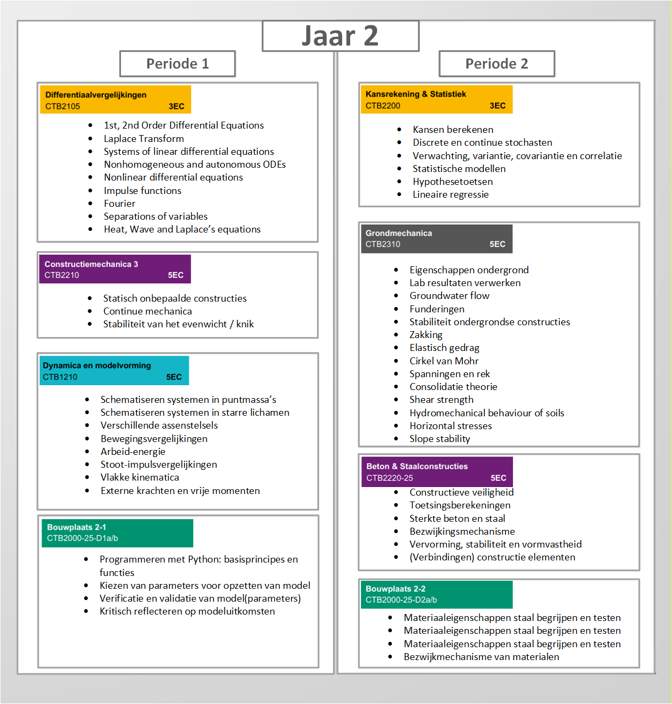
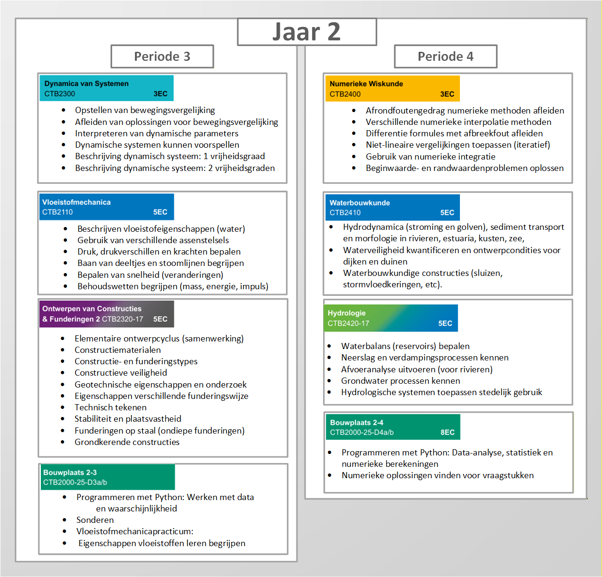

# Jaar 2 
In het tweede jaar van de bachelor Civiele Techniek wordt voortgebouwd op de basis die in het eerste jaar is gelegd. De focus ligt op verdieping en toepassing van eerder verworven kennis en vaardigheden. Met name de wiskundige en mechanische vakken spelen een belangrijke rol, omdat zij worden ingezet om complexere civieltechnische vraagstukken te analyseren en op te lossen.

Daarnaast ga je in het tweede jaar dieper in op de verschillende disciplines binnen de civiele techniek, zoals constructies, water en geotechniek. De samenhang tussen deze onderdelen wordt steeds duidelijker door integratie in projecten en practica. De kennis en vaardigheden die je in dit jaar opdoet vormen een essentiële schakel tussen de brede basis van jaar 1 en de verdere specialisatie en professionalisering in de latere jaren van de opleiding.

## Eerste Semester

## Tweede Semester

